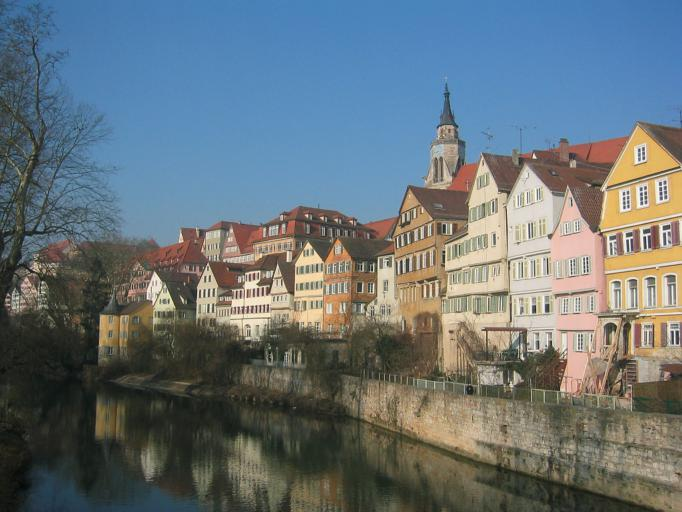
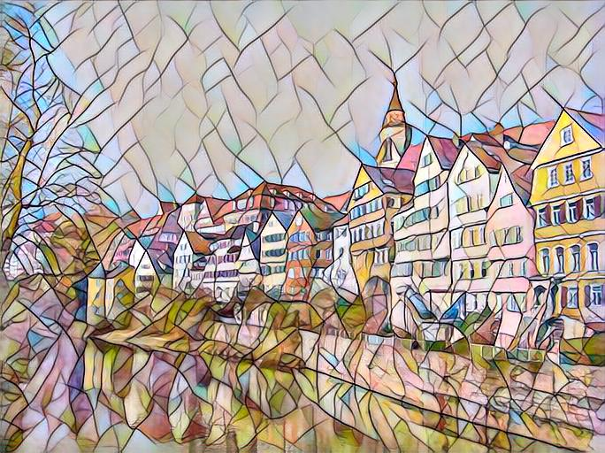

# Perceptual_Loss
This is a re-implement of [fast neural style transfer](https://github.com/pytorch/examples/tree/master/fast_neural_style)
 with some small modification

## How to train 
```
python train.py train --dataset <dataset dir> --style-image <style-image path> --save-model-dir <the save model path> --cuda <using gpu or not>
```
If you have any problem with setting arguments, just type:  
`python train.py train -h`  
Will give you more details and more arguments which you can easily tune

## How to evaluate
```
python train.py eval --content-image <content image path> --output-image <output image name> --model <saving model path by training> --cuda <gpu or not>
```


## Dataset
Using [Coco 2014 train images](http://cocodataset.org/#download)<83K/13GB>
You have to build your dataset directory structure look like:
```
. 
├── datasets                   
|   ├── <dataset_name>         # i.e. 
|   |   ├── train              # train image dir name e.g.train2014
|   |   |   └── A              # contains all the train images 
```


## Result
<p align="center">
  
  
  
</p>

## Requirement
```
pytorch=1.4.0
torchvision=0.5.0
numpy=1.17.4
pillow=6.2.1
robustness=1.1.0 (please install in pip)
```
